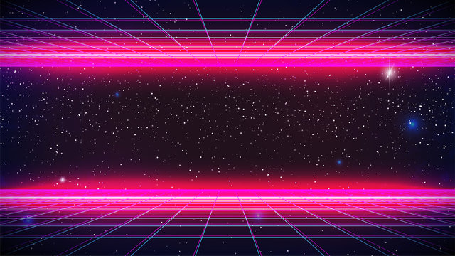

  

<h1 align="center">🧠 Terence | Full Stack Dev & AI Architect</h1>

  

  <i><b style="color:#f0f">Développeur full-stack</b> explorant les apps web, desktop, mobile, avec un intérêt particulier pour le Rust-Universe et le cloud/IA.</i> 
  <i><b style="color:#0ff">Créer intelligemment, coder, tester, corriger, tester encore et encore ! Tel est ma discipline.</b></i>

---

## ⚙️ Stack & Technologies

  
  
  
  
  
  
  
  
  
  
  
  

---

## 🌐 À propos de moi

📍 Basé au Québec  
🛠️ Full stack + IA + DevOps  
🧠 Je développe des outils locaux intelligents, offline-first, respectueux de la vie privée  
🧪 J’adore expérimenter : Tauri, Ollama, Langchain, Rust, Go, Elixir...

---

## 🚀 Projets en lumière

| Projet | Tech | Description |
|--------|------|-------------|
| 🔐 [HN_Smart_Hub](https://github.com/0xAdafang/HN_Smart_Hub) | Rust / Elixir / React | App desktop RH avec assistant IA local |
| 🧠 LLM Sentinel *(privé)* | Rust / Go / Python | Framework modulaire IA offline |
| 🃏 RustCards *(soon)* | Rust | Jeu de cartes post-apocalyptique |
| 📱 [PolyBooster](https://github.com/0xAdafang/PolyBooster) | Kotlin | App Android de vocabulaire par boosters |
| 🍔 [FastFoodSimulator](https://github.com/0xAdafang/FastFoodSimulator) | Rust | Simu multi-rôle avec async / file d’attente |
| 🕹 [Retro_Market](https://github.com/0xAdafang/Retro_Market) | TS / PostgreSQL | Marketplace rétro avec panier & backoffice |

---

## 🧬 Philosophie

  

J’aime construire des outils **simples mais puissants**, maîtriser toute la stack (de l’UI au bas niveau), et proposer des solutions **offlines, locales et éthiques**.  
Je m’investis dans chaque projet avec une logique d’apprentissage et de progression continue. Je suis toujours poussé par la curiosité d’apprendre de nouvelles choses.

---

## 📬 Me contacter

- 📫 Email : [adafang@proton.me](mailto:adafang@proton.me)
- 🌐 GitHub : [@0xAdafang](https://github.com/0xAdafang)

---

> 🔹 *Si un projet t’inspire, laisse une étoile ou envoie un message !*
